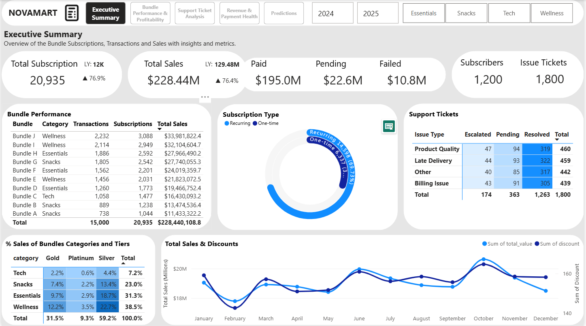
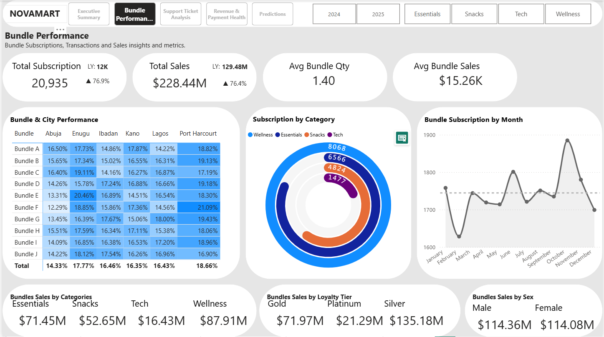
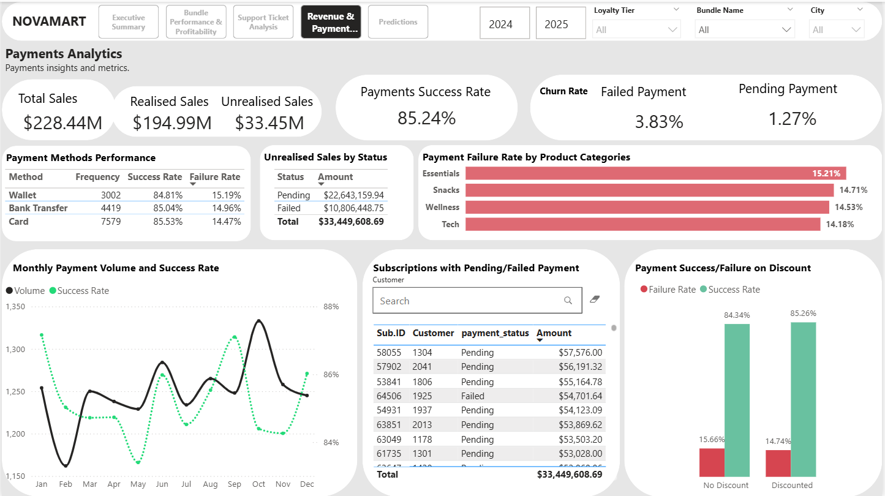

# 🛒 NovaMart Retail Analytics Dashboard  
**Power BI Case Study – NovaMart**

---

## 📌 Project Summary  
NovaMart, a growing retail business, wanted to move beyond intuition-driven decisions and adopt a **data-driven approach** to track sales, profitability, and regional performance.  

The aim of this project was to design an **end-to-end analytics solution** using **PostgreSQL + Power BI** to transform fragmented sales and inventory data into actionable insights.  

The result was a fully interactive **Power BI dashboard** that empowers NovaMart’s leadership to:  
- Monitor product performance  
- Track revenue and profitability trends  
- Compare regional sales outcomes  
- Support strategic pricing and stocking decisions  

---

## 🔍 Problem Statement  
NovaMart lacked a centralised way to evaluate **sales, profit margins, and regional trends**. Reports were scattered across systems, making it difficult for managers to identify high-performing products and growth opportunities.  

As a Data Analyst, my responsibilities included:  
- Querying and preparing clean datasets from PostgreSQL  
- Modelling the data for business relevance  
- Identifying actionable insights across products, sales teams, and regions  
- Designing Power BI dashboards tailored to NovaMart’s business needs  

---

## 📦 Dataset Overview  
The dataset included NovaMart’s **sales transactions, product catalogues, customer information, and regional sales records**. Key fields include:  

| Field            | Description                                     |  
|------------------|-------------------------------------------------|  
| TransactionID    | Unique ID for each retail transaction           |  
| Date             | Date of sale                                    |  
| RevenueAmount    | Total revenue generated per transaction         |  
| Quantity         | Units sold per transaction                      |  
| ProductName      | Name of the product                             |  
| Category         | Product category (e.g., Electronics, Clothing)  |  
| Region, Store    | Regional and store-level sales information      |  
| CustomerGender   | Demographic attribute of the customer           |  

---

## 💡 Analytical Tasks  

### 🔧 Data Preparation  
- Queried and cleaned raw sales data in **PostgreSQL**  
- Created **fact and dimension tables** for sales, products, and regions  
- Applied **Power Query transformations** in Power BI to refine datasets  

### 📊 Data Modelling  
- Established relationships between fact (sales) and dimension tables (products, regions, customers)  
- Defined measures in **DAX**:  
  - Total Revenue  
  - Profit Margin  
  - Units Sold  
  - Average Order Value  
  - Month-over-Month Sales Growth  

### 📈 Dashboard Development  
Created **two dashboards** with interactive visuals:  

**Dashboard 1: Sales & Profitability Analysis**  
- Revenue and profit trends over time  
- Top-performing products and categories  
- Contribution of top 20% of products to total profit (Pareto analysis)  
- Seasonal demand patterns  

**Dashboard 2: Regional & Customer Insights**  
- Revenue by region and store location  
- Underperforming regions vs. targets  
- Customer demographics by gender and region  
- Regional sales growth heatmap  

---

## 📈 Key Insights & Outcomes  
- **Revenue Trends:** Clear seasonal demand spikes during holidays boosted inventory planning.  
- **Top Products:** 20% of products generated 80% of profits.  
- **Regional Performance:** Certain regions consistently underperformed, guiding resource reallocation.  
- **Customer Insights:** Demographic breakdowns showed gender-specific preferences in product categories.  
- **Strategic Decisions:** Leadership could now plan **pricing, promotions, and stock allocation** with data-driven confidence.  

---

## 🧰 Tools & Technologies  
- **PostgreSQL** – SQL queries for data preparation  
- **Power BI** – Dashboard design, KPI modelling, interactive visualisation  
- **Power Query** – Data cleaning and transformation  
- **DAX** – Measure creation for financial and operational metrics  
- **Excel** – Preliminary exploration and validation  

---

## 🎯 Skills Demonstrated  
- SQL query optimisation and database management  
- Data cleaning and transformation with Power Query  
- Data modelling (fact/dimension schema) in Power BI  
- DAX calculations for KPIs  
- Dashboard design aligned with business needs  
- Retail analytics and business insight generation  

---

## 📷 Dashboard Preview  
### Executive Sales Overview  
  

### Product Performance  
  

### Payments Insights  
  

---

## 📂 Repository Structure  
NovaMart.pbix 
